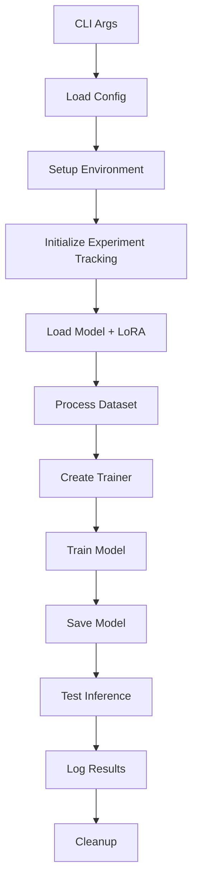

# 🏗️ Kiến trúc Pipeline Training Gemma3N

## 📋 Tổng quan

Dự án đã được refactor từ một Jupyter notebook thành một pipeline modular với kiến trúc rõ ràng, dễ bảo trì và mở rộng. Pipeline được thiết kế để fine-tune mô hình Gemma3N cho bài toán hỗ trợ học toán lớp 6 bằng tiếng Việt.

## 🎯 Mục tiêu thiết kế

- **Modularity**: Tách biệt các chức năng thành modules độc lập
- **Reusability**: Code có thể tái sử dụng cho các dự án khác
- **Maintainability**: Dễ bảo trì và debug
- **Extensibility**: Dễ mở rộng với các tính năng mới
- **Configurability**: Linh hoạt trong cấu hình
- **Testability**: Dễ test từng component

## 🏛️ Kiến trúc tổng quan

```
┌─────────────────────────────────────────────────────────────┐
│                    CLI Interface                            │
│                 (train_gemma.py)                           │
└─────────────────────┬───────────────────────────────────────┘
                      │
┌─────────────────────▼───────────────────────────────────────┐
│                Configuration Layer                         │
│              (TrainingConfig, CometConfig)                 │
└─────┬─────────────────────────────────────────────────────┬─┘
      │                                                     │
┌─────▼──────┐  ┌─────────────────┐  ┌─────────────────┐   │
│   Data     │  │     Models      │  │   Training      │   │
│ Processing │  │   Management    │  │    Engine       │   │
└─────┬──────┘  └─────────┬───────┘  └─────────┬───────┘   │
      │                   │                    │           │
┌─────▼──────┐  ┌─────────▼───────┐  ┌─────────▼───────┐   │
│  Dataset   │  │  Model Loader   │  │ Trainer Factory │   │
│ Processor  │  │  LoRA Config    │  │Training Utils   │   │
│Chat Format │  │  Model Saver    │  │                 │   │
└────────────┘  └─────────────────┘  └─────────────────┘   │
                                                           │
┌─────────────────────────────────────────────────────────┬─▼─┐
│                  Supporting Services                    │   │
├─────────────────┬─────────────────┬─────────────────────┤   │
│   Experiments   │    Inference    │      Utilities      │   │
│     Tracking    │     Engine      │    (Logging, etc)   │   │
└─────────────────┴─────────────────┴─────────────────────┘   │
                                                             │
┌───────────────────────────────────────────────────────────▼─┐
│                    External Integrations                    │
│         (Unsloth, TRL, PEFT, Comet ML, HF Hub)             │
└─────────────────────────────────────────────────────────────┘
```

## 📂 Cấu trúc chi tiết

### 1. Configuration Layer (`config/`)
```python
config/
├── base_config.py      # Base configuration với save/load
├── training_config.py  # Cấu hình training (model, dataset, hyperparams)
└── comet_config.py     # Cấu hình Comet ML tracking
```

**Chức năng:**
- Quản lý tất cả cấu hình của pipeline
- Hỗ trợ load/save từ YAML, JSON
- Validation cấu hình
- Type-safe configuration với dataclasses

### 2. Data Processing (`data/`)
```python
data/
├── dataset_processor.py  # Load và process datasets
└── chat_formatter.py     # Format chat templates
```

**Chức năng:**
- Load datasets từ HuggingFace Hub
- Chuyển đổi định dạng question/solution → conversation
- Apply chat templates cho Gemma3N
- Preview và statistics datasets

### 3. Models Management (`models/`)
```python
models/
├── model_loader.py     # Load models với Unsloth
├── lora_config.py      # LoRA configuration management
└── model_saver.py      # Save models ở nhiều format
```

**Chức năng:**
- Load Gemma3N với Unsloth optimizations
- Apply LoRA adapters với configurations linh hoạt
- Save models ở nhiều format (LoRA, merged, GGUF)
- Model memory management

### 4. Training Engine (`training/`)
```python
training/
├── trainer_factory.py  # Tạo SFTTrainer với configs
└── training_utils.py   # Utilities cho training
```

**Chức năng:**
- Tạo SFTTrainer với SFTConfig
- Setup response-only training với Unsloth
- Training monitoring và utilities
- Memory và device management

### 5. Experiment Tracking (`experiments/`)
```python
experiments/
└── comet_tracker.py    # Comet ML integration
```

**Chức năng:**
- Setup Comet ML experiments
- Log metrics, parameters, models
- Handle errors gracefully
- Support multiple tracking platforms

### 6. Inference Engine (`inference/`)
```python
inference/
└── inference_engine.py  # Model inference với optimizations
```

**Chức năng:**
- Generate responses với various configs
- Batch inference
- Streaming generation
- Benchmark inference performance

### 7. Utilities (`utils/`)
```python
utils/
├── logging.py         # Enhanced logging với emojis
└── device_utils.py    # Device và memory management
```

**Chức năng:**
- Rich logging với colors và emojis
- CUDA memory monitoring
- Device detection và benchmarking
- Memory optimization utilities

### 8. CLI Interface (`cli/`)
```python
cli/
└── train_gemma.py     # Main command line interface
```

**Chức năng:**
- Command line argument parsing
- Configuration override từ CLI
- Integration tất cả components
- Error handling và logging

## 🔄 Data Flow



## 🧩 Key Components

### Configuration Management
```python
# Type-safe configuration với validation
@dataclass
class TrainingConfig(BaseConfig):
    model_name: str = "unsloth/gemma-3n-E4B-it"
    max_seq_length: int = 2048
    # ... other fields
    
    def validate(self) -> None:
        # Validation logic
        
    def to_sft_config_kwargs(self) -> Dict[str, Any]:
        # Convert to SFTConfig format
```

### Model Loading với Unsloth
```python
class ModelLoader:
    def load_complete_model(self) -> Tuple[Any, Any]:
        # Load với Unsloth optimizations
        model, processor = FastModel.from_pretrained(...)
        model = FastModel.get_peft_model(model, **lora_config)
        return model, processor
```

### Flexible Training Setup
```python
class TrainerFactory:
    def create_trainer(self, model, tokenizer, dataset) -> SFTTrainer:
        # Setup SFTTrainer với custom configs
        trainer = SFTTrainer(...)
        # Response-only training với Unsloth
        trainer = train_on_responses_only(trainer, ...)
        return trainer
```

### Multi-format Model Saving
```python
class ModelSaver:
    def save_all_formats(self, formats: Dict[str, Dict]) -> Dict[str, str]:
        # Save LoRA adapters, merged models, GGUF, etc.
        # Support HuggingFace Hub upload
```

## 🔧 Extensibility Points

### 1. Custom Dataset Processors
```python
class CustomDatasetProcessor(DatasetProcessor):
    def custom_preprocessing(self, sample):
        # Implement custom logic
        return processed_sample
```

### 2. Custom LoRA Configurations
```python
# Easy LoRA config management
lora_config = LoRAConfigManager.create_lora_config(
    r=32, 
    target_modules=["custom_modules"],
    custom_param=value
)
```

### 3. Custom Training Strategies
```python
class CustomTrainerFactory(TrainerFactory):
    def create_custom_trainer(self, ...):
        # Implement custom training logic
        return trainer
```

### 4. Multiple Experiment Trackers
```python
# Easy to add new trackers
class WandBTracker(BaseTracker):
    def setup_experiment(self, config):
        # WandB setup logic
```

## 📊 Monitoring và Debugging

### Rich Logging
```python
logger = TrainingLogger()
logger.info("Training started")
logger.metric("loss", 0.5, step=100)
logger.model_info("Gemma3N", 1000000, 50000)
```

### Memory Monitoring
```python
# Automatic memory tracking
result, memory_stats = DeviceUtils.monitor_memory_usage(trainer.train)
print(f"Peak memory: {memory_stats['peak_memory_gb']:.2f}GB")
```

### Experiment Tracking
```python
# Automatic metric logging
comet_tracker.setup_experiment(config)
# Training tự động log metrics
trainer.train()
comet_tracker.log_model(model_path)
```

## 🚀 Usage Patterns

### 1. Quick Development
```bash
make train-dev  # Development config
python scripts/quick_test.py  # Quick test
```

### 2. Production Training
```bash
make train-prod  # Production config với full tracking
```

### 3. Custom Experiments
```python
# Programmatic usage
config = TrainingConfig.from_yaml("my_config.yaml")
config.max_steps = 1000
# ... rest of pipeline
```

### 4. Batch Experiments
```python
# Easy to run multiple experiments
for lr in [1e-4, 2e-4, 5e-4]:
    config.learning_rate = lr
    config.experiment_name = f"lr_{lr}"
    # Run training pipeline
```

## 🔮 Future Extensions

### 1. Multiple Model Support
- Dễ dàng support Llama, Mistral, etc.
- Abstract model loading interface

### 2. Advanced Training Methods
- DPO, PPO training
- Multi-GPU support
- Distributed training

### 3. Production Deployment
- Model serving với FastAPI
- Docker containerization
- Cloud deployment scripts

### 4. Evaluation Framework
- Automatic evaluation metrics
- A/B testing framework
- Performance monitoring

## 📈 Benefits của Kiến trúc

### 1. Maintainability
- **Separation of Concerns**: Mỗi module có trách nhiệm riêng biệt
- **Clear Interfaces**: APIs rõ ràng giữa các components
- **Error Isolation**: Lỗi trong một module không ảnh hưởng toàn bộ

### 2. Testability
- **Unit Testing**: Test từng module độc lập
- **Integration Testing**: Test workflows end-to-end
- **Mock Dependencies**: Dễ mock external services

### 3. Reusability
- **Config Templates**: Tái sử dụng configs cho experiments khác
- **Model Components**: Reuse model loading, saving logic
- **Training Patterns**: Apply cho models khác

### 4. Scalability
- **Experiment Management**: Dễ scale số lượng experiments
- **Resource Management**: Optimal memory và compute usage
- **Batch Processing**: Support training multiple models

## 🎓 Lessons Learned

### 1. Configuration is Key
- Type-safe configs prevent runtime errors
- YAML/JSON configs enable easy experimentation
- Config validation catches issues early

### 2. Logging and Monitoring
- Rich logging significantly improves debugging
- Memory monitoring prevents OOM crashes
- Experiment tracking enables reproducibility

### 3. Error Handling
- Graceful degradation when optional services fail
- Clear error messages guide users
- Automatic cleanup prevents resource leaks

### 4. Documentation
- Code documentation improves maintainability
- Usage examples reduce learning curve
- Architecture docs help new contributors

## 🔚 Kết luận

Kiến trúc modular này cung cấp:
- **Flexibility**: Dễ experiment với các configs khác nhau
- **Reliability**: Robust error handling và monitoring
- **Performance**: Optimized với Unsloth và best practices
- **Usability**: Simple CLI và clear documentation

Pipeline này không chỉ hoạt động tốt cho Gemma3N mà còn có thể dễ dàng adapt cho các models và tasks khác.